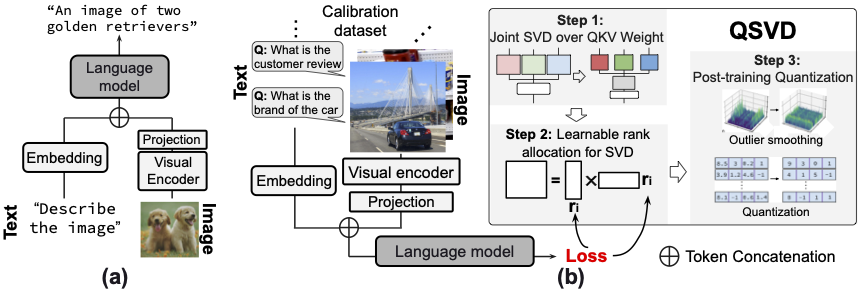

# QSVD: Efficient Low-Rank Approximation for Unified Query-Key-Value Weight Compression in Low-Precision Vision-Language Models

This repository provides the official implementation of **QSVD**, a method for efficient low-rank approximation that unifies Query-Key-Value (QKV) weight compression in low-precision Vision-Language Models (VLMs).



## 🔧 Requirements

This implementation utilize the myllava repository, adapted from the original [LLaVA repo](https://github.com/haotian-liu/LLaVA). Please follow the steps below to set up the environment:

```bash
conda create -n QSVD python=3.10 -y
conda activate QSVD
pip install torch==2.6.0 torchvision==0.21.0 torchaudio==2.6.0 --index-url https://download.pytorch.org/whl/cu126
cd third-party/fast-hadamard-transform
pip install -e .
cd ../..
cd myllava
pip install --upgrade pip  # Enable PEP 660 support
pip install -e .
cd ..
pip install -e . --no-build-isolation
```

<!-- > ⚠️ Note: Ensure the QSVD components and any relevant QuaRot setup are reinstalled correctly. -->

## 📊 Evaluation

To evaluate QSVD and reproduce our results, follow the steps below.

### 📁 Dataset Preparation

Follow the [LLaVA evaluation guide](https://github.com/haotian-liu/LLaVA/blob/main/docs/Evaluation.md) to prepare the following datasets:
- **ScienceQA** (Train)
- **VizWiz** (Test)

Update the paths in `eval_*.py` and `data_utils.py` accordingly.

### 🛠 Evaluation Toolkit

We use [third_party/VLMEvalKit](https://github.com/open-compass/VLMEvalKit/blob/main/docs/en/Quickstart.md) for evaluation. Set it up as per their quickstart guide.

### ▶️ Running Evaluations

To reproduce our main results:

```bash
cd fake_quant
```

For example usage and custom evaluations, explore the scripts:

```bash
cd scripts
```

## 🤝 Contributing

This project builds upon the excellent work of:
- [QuaRot](https://github.com/spcl/QuaRot)
- [ASVD](https://github.com/hahnyuan/ASVD4LLM)
- [SVDLLM](https://github.com/AIoT-MLSys-Lab/SVD-LLM)

We thank these projects for their contributions to the community.
